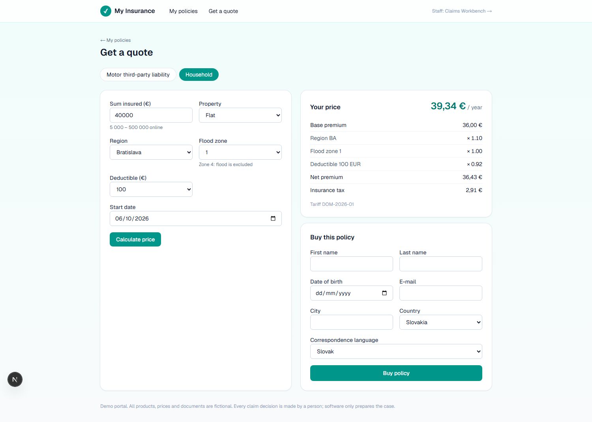
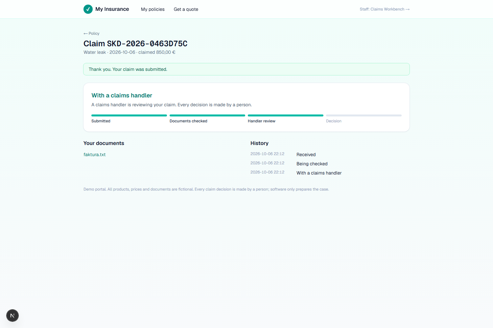
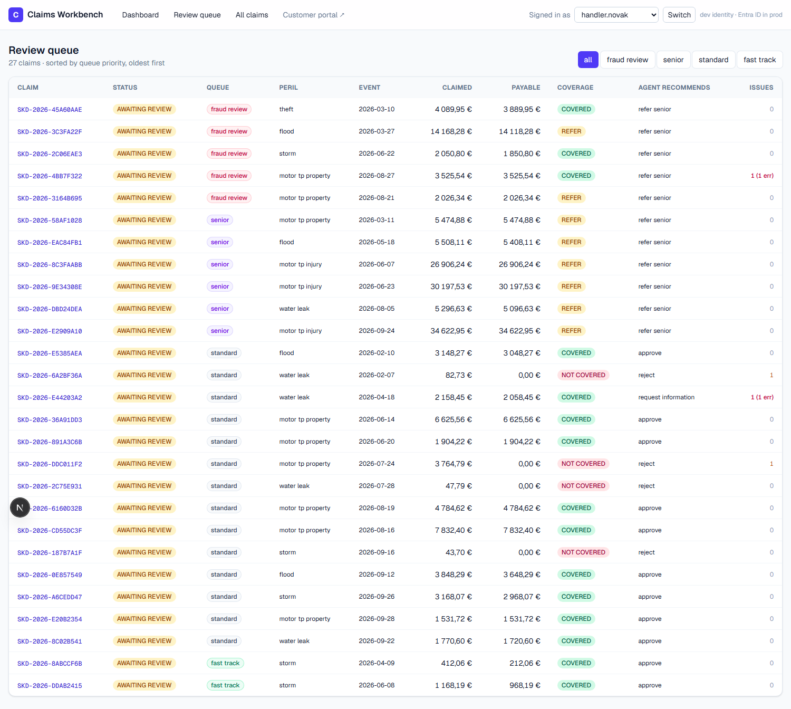
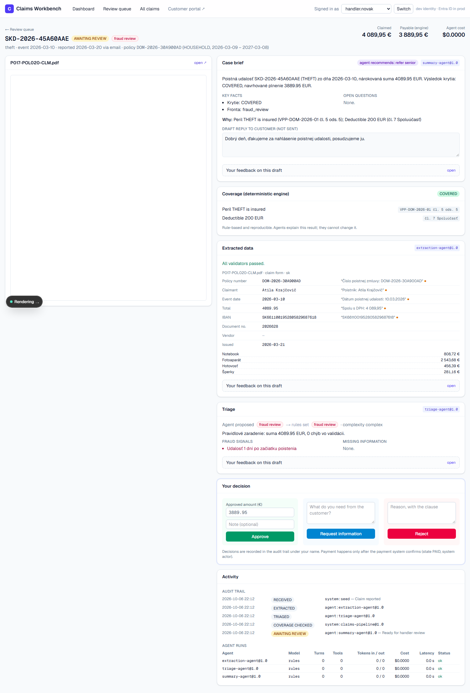

# Agentic Insurance Platform

A scaled-down insurance core (customers, products, tariffs, policies, claims) with an agentic claims layer built on Claude and MCP, a customer portal and a CRM for claims handlers.

When a customer reports a claim in the portal, the uploaded documents go onto a durable job queue. A worker runs the agent pipeline: it reads the documents in Slovak or German, extracts and validates the data, triages the claim, checks coverage with a deterministic engine, and writes a case brief. A claims handler then reviews the prepared case in the CRM and decides.

> **Agents propose, deterministic code decides.**
> Premiums, coverage and payouts come from tested rule engines. Agents read, extract, classify and explain. No agent and no MCP tool can approve, reject or pay, and tests enforce both.

## Run the demo

```bash
python -m venv .venv && .venv/Scripts/activate     # Linux/macOS: source .venv/bin/activate
pip install -e ".[dev]"
python -m aip.demo                     # fresh DB → mock claims with PDFs → agents → API :8000 + queue worker

cd web && npm install && npm run dev   # http://localhost:3000         handler CRM
                                       # http://localhost:3000/portal  customer portal
```

The demo works without an API key, using offline rule-based stand-ins for the agents. `python -m aip.demo --llm --limit 5` sends the first five claims, and everything reported in the portal afterwards, through Claude (needs `ANTHROPIC_API_KEY`).

Try it end to end:
1. In the portal, get a quote, buy a policy, and report a claim with a PDF or text file.
2. The claim page updates on its own while the worker processes it.
3. In the CRM, open the claim, correct a field, and request information or decide.
4. Back in the portal, answer the request. The claim goes through the agents again.

## Screenshots

| Customer portal: quote | Customer portal: claim status |
|---|---|
|  |  |

| CRM: review queue | CRM: case view |
|---|---|
|  |  |

The Playwright E2E run captures these. The embedded PDF is blank in headless Chromium but renders in a normal browser.

## How a claim flows

```
Portal: report claim + upload ─► job enqueued in the same transaction ─► worker leases the job
  ─► Extraction agent ─► validators ─► Triage agent ──(MCP tools)──► core API
       (Claude, no tools)  (IBAN, totals,   (Claude + tools: policy,
                            dates, grounding) claim history, documents)
  ─► Coverage engine (deterministic, clause references) ─► routing rules
  ─► Summary agent (Slovak brief + draft reply) ─► AWAITING_REVIEW ─► handler decides in the CRM
                                                                   └► NEEDS_INFO ─► customer answers ─► queue again
```

**Every step:**
- masks personal data before the model sees it;
- records model, tokens, cost and latency;
- escalates to a human on any failure.

**Failed jobs** are retried with backoff. After the last attempt the claim goes to a human. A sweeper recovers jobs from crashed workers and claims stuck mid-pipeline.

## What is implemented

| Area | What | Where |
|---|---|---|
| Core | Products, versioned explainable tariffs, coverage engine, claim state machine with actor permissions, audit trail, documents | [src/aip/core](src/aip/core) |
| REST API | Parties, quotes, policies, claims, documents, coverage, transitions, agent drafts, run log, job queue | [app.py](src/aip/api/app.py) |
| Job queue | Transactional enqueue, `SKIP LOCKED` leasing, retries with backoff, dead-letter → human, debounce, reconciliation sweeper; stateless workers over HTTP | [jobs.py](src/aip/core/jobs.py), [worker.py](src/aip/agents/worker.py) |
| Migrations | Alembic, async, Postgres and SQLite; a test keeps them identical to the models | [migrations/](src/aip/migrations) |
| LLM gateway | Anthropic SDK (Anthropic API or Microsoft Foundry), structured output, effort, refusal fallbacks, cost | [src/aip/llm](src/aip/llm) |
| PII masking | Known values + checksum-validated patterns (rodné číslo, IBAN, …), consistent tokens, unmasking | [masking.py](src/aip/llm/masking.py) |
| Agent runtime | Bounded tool-use loop: allow-list, budgets, schema validation with one retry, L2 cache | [runtime.py](src/aip/agents/runtime.py) |
| Agents | Extraction, triage (with MCP tools), handler summary; offline rule-based stand-ins | [src/aip/agents](src/aip/agents) |
| MCP server | Read-only tools over the core API, server-side allow-lists, stdio or Streamable HTTP | [server.py](src/aip/mcp/server.py) |
| Mock data | SK/AT customers, policies, claims, **PDF documents** (forms and free-text e-mails) with labels and injected anomalies | [seed/](src/aip/seed), [data/](data) |
| Evals | Field accuracy with bootstrap CIs, slices, anomaly detection, masking recall, cost, CI gates | [src/aip/evals](src/aip/evals) |
| Customer portal | Quote with premium breakdown, buy, report a claim with documents, live claim status, answer information requests | [web/src/app/portal](web/src/app/portal) |
| Handler CRM | Review queue, case view (PDF next to extracted fields and evidence), accept/edit/reject feedback on agent drafts, decisions, agent quality and job queue dashboard | [web/](web) |
| Tests | 110 Python tests (domain invariants, API, masking, agent loop, MCP allow-lists, pipeline, queue and worker, migrations) + Playwright E2E for the handler and customer journeys | [tests/](tests), [web/e2e](web/e2e) |

## Quick start (without the web app)

```bash
pytest                                       # 110 tests, no network
python -m aip.seed --load                    # mock customers, policies, claims + PDFs
python -m aip.agents process --all --offline # whole pipeline without an API key
```

With Claude (needs `ANTHROPIC_API_KEY`, see `.env.example`):

```bash
python -m aip.agents process --all --limit 3
python -m aip.agents show SKD-2026-XXXXXXXX       # extraction, triage, brief for one claim
python -m aip.agents worker                       # process the job queue continuously
python -m aip.evals extraction --extractor llm --limit 30
```

Explore with the API docs:

```bash
uvicorn aip.api.app:app --reload                   # http://localhost:8000/docs
```

Or ask Claude Code about claims through the MCP server. It is configured in [.mcp.json](.mcp.json) and needs the API running.

## Run on Postgres with Docker Compose

```bash
docker compose up -d --build api mcp worker   # Postgres, migrations, API :8000, MCP :8766, worker, cache
docker compose run --rm seed                  # mock data
cd web && npm run dev                         # the web app talks to :8000
```

The worker runs in offline mode by default. Remove `--offline` in [docker-compose.yml](docker-compose.yml) and set `ANTHROPIC_API_KEY` to use Claude.

## Eval: why the LLM is needed

Critical fields are policy number, event date, total and IBAN.

| Layout | Regex baseline | Claude extraction agent |
|---|---|---|
| Structured forms | 100% | run `python -m aip.evals extraction --extractor llm` |
| Free-text customer e-mails | 25% | ↑ |

The baseline is perfect on its own templates and fails on free text. That is the slice where the model has to justify its cost.

## Documentation

| Document | For |
|---|---|
| [Architecture + decision log + review log](docs/architecture/README.md) | Design, 13 ADRs, three review rounds |
| [Diagrams](docs/architecture/diagrams.md) | Context, containers, state machine, sequence, agent loop, caching, data model, deployment |
| [Testing strategy](docs/architecture/testing-strategy.md) | Test pyramid, invariants, evals, CI |
| [Discovery session guide](docs/discovery/session-guide.md) | How requirements are gathered from claims handlers |
| [Roadmap](docs/roadmap.md) | Done and next |

## Disclaimer

All products, tariffs, clauses, people and documents in this repository are fictional and synthetic.
