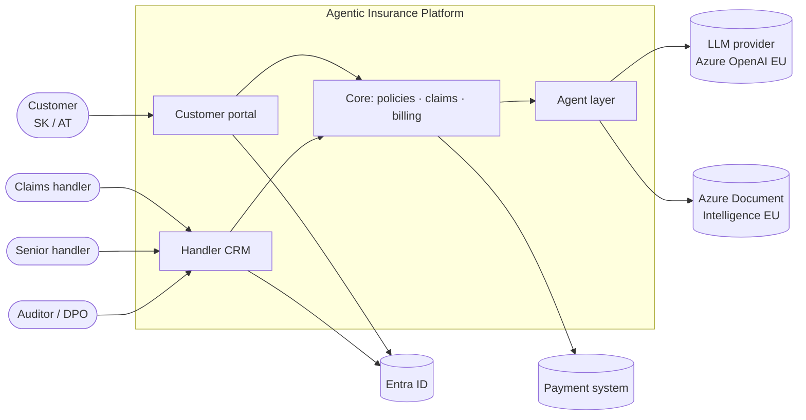
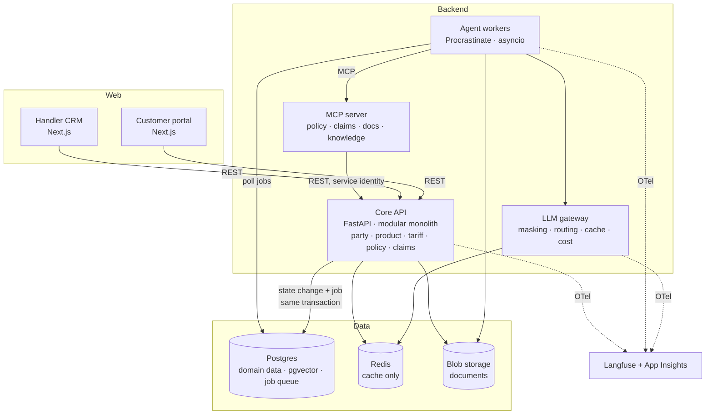
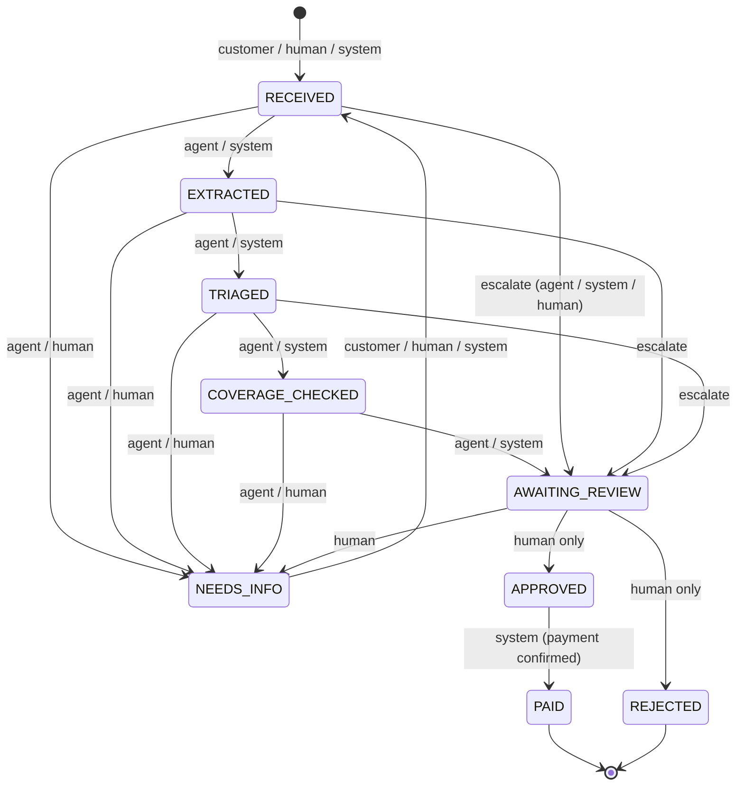
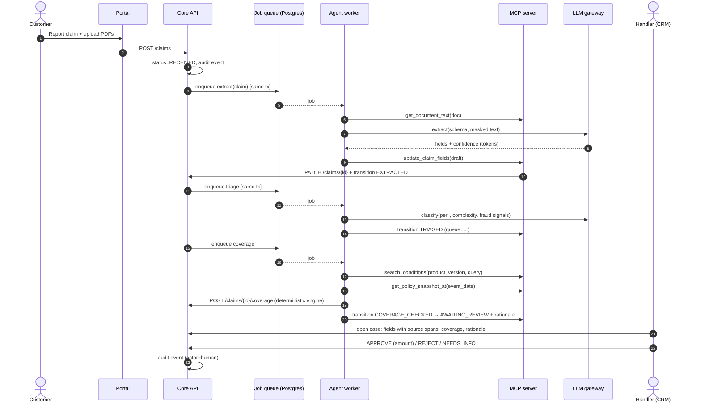
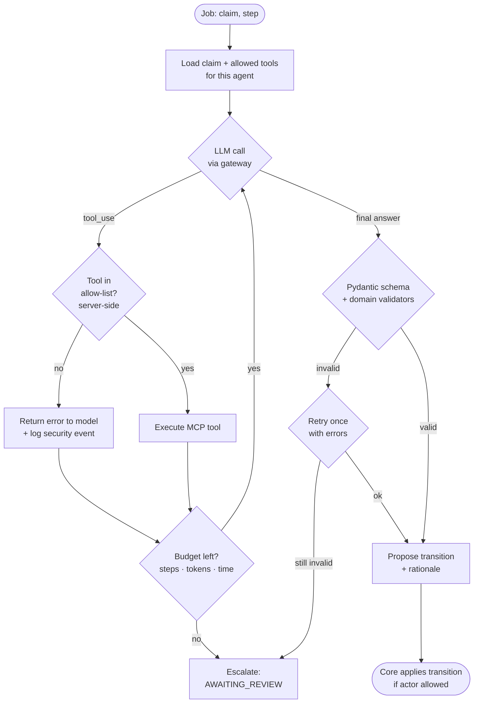
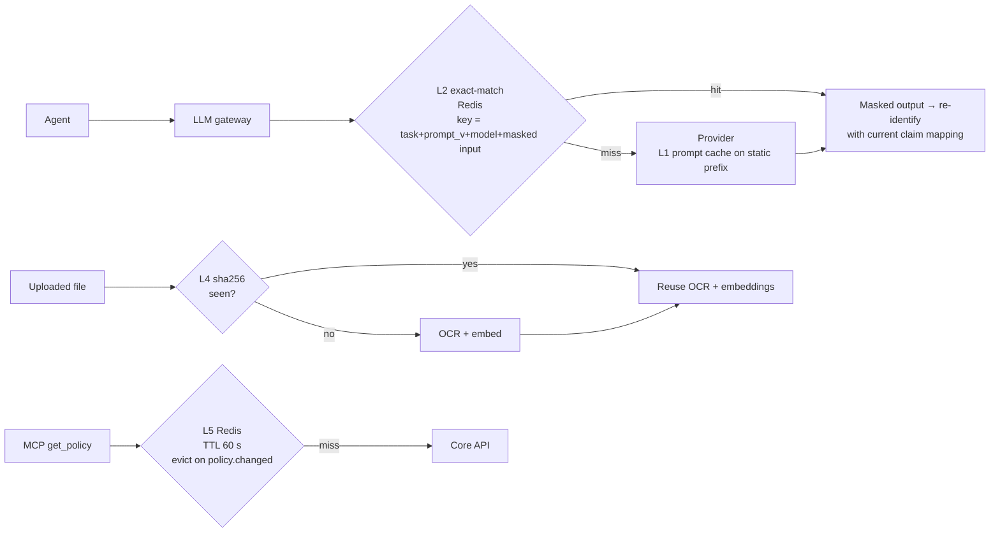
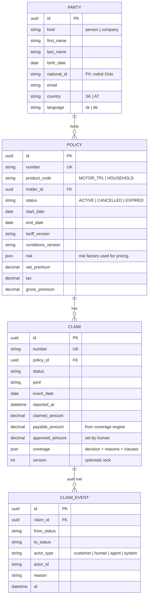
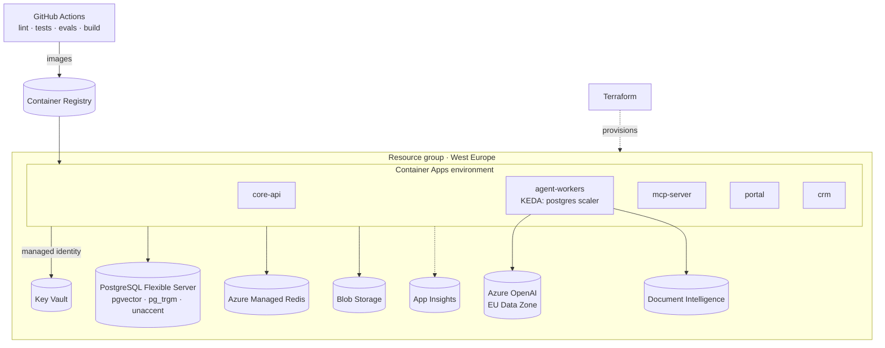

# Architecture diagrams

All diagrams are Mermaid and render on GitHub. They describe the target architecture.
The [roadmap](../roadmap.md) shows which parts are already implemented.

## 1. System context

Who uses the platform and what it talks to.

## 2. Containers

Deployable units and backing services (ADR 0001, 0004, 0005, 0008).

## 3. Claim lifecycle (state machine)

Implemented in `src/aip/core/claims/state_machine.py`. Edge labels show **who may perform the transition**.
No AGENT edge leads to `APPROVED`, `REJECTED` or `PAID`. A unit test enforces this invariant.

## 4. Claim processing sequence (target, phases 2–4)

## 5. Inside one agent step

ADR 0003: one bounded agent per state transition.

## 6. Caching layers

ADR 0005.

## 7. Data model (core)

Implemented in `src/aip/core/*/models.py`.

## 8. Deployment (Azure)

ADR 0009.

